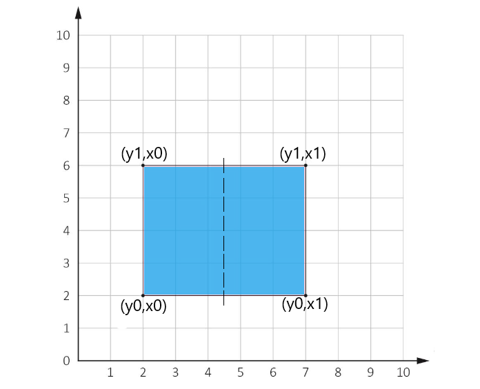

When a book pdf has been scanned with two pages per sheet, but its order is messed up and it can't be printed as a booklet or book.

This script takes care of that, using the PyPDF2 lib to read the old pages, crop them in half and then make a new pdf.

The image below explains how the pdf is cut. The cut area has four points, from which the area is divided in half. 

Sometimes it resizes to the left, sometimes to the right

*If you want to see your file's coordinates, uncomment the lines in the eval method.*

**For usage**: Insert the pdf into this folder and then run the script
